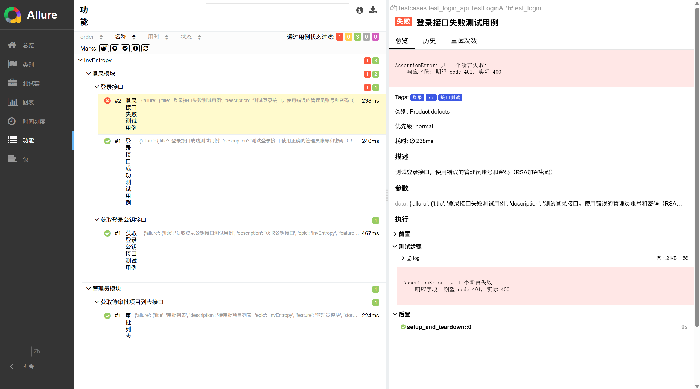

# 接口自动化测试框架
### 技术栈：Python + Pytest + Requests + Github Actions(CI/CD) + Allure
针对个人项目 **InvEntropy** 打造的轻量级接口自动化测试框架，
解决手工测试效率低、回归测试成本高、接口质量难监控的问题，落地测试开发核心思想。  


## 核心特性
✅ 多环境适配：开发/测试/生产环境一键切换，无需修改用例代码  
✅ 数据驱动：YAML 解耦用例数据，新增用例仅需编写配置文件  
✅ 可视化报告：Allure 生成详细报告，支持本地查看+Github Pages 远程部署  
✅ CI/CD 自动化：Github Actions 实现「代码提交→自动测试→报告部署」全流程  
✅ 易用性：一键运行脚本，新手快速上手  


#### 相关仓库
[InvEntropy后端](https://github.com/Hsyuan54670/InvEntropy-backend.git) |
[InvEntropy前端](https://github.com/Hsyuan54670/InvEntropy-frontend.git) | [InvEntropy部署](https://github.com/Hsyuan54670/InvEntropy-run.git)


## 效果展示

Allure 报告在线查看：[GitHub Pages](https://Hsyuan54670.github.io/yuan-api-autotest-framwork/)

### 快速开始
#### 克隆项目
```bash
git clone https://github.com/Hsyuan54670/yuan-api-autotest-framwork.git
```
#### 安装依赖
```bash
pip install -r requirements.txt
```
#### 配置.env文件
```text
主要是设置base_url和环境变量((common/config.py))，支持多环境切换
```
#### 运行测试
###### 方法一：(命令行启动,需要手动生成Allure报告)
```bash
pytest
```
###### 方法二：(运行启动文件，会自动生成Allure报告)
```bash
python3 start.py
```
